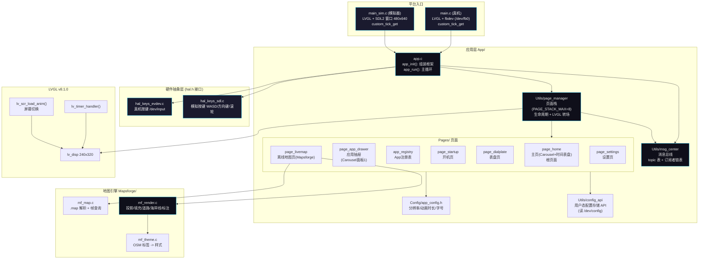

# App 框架框图 (Block Diagram)



> 说明：
> - 真机与模拟器通过 **HAL 接口**（`hal.h`）隔离，由各 Makefile 选择编译不同实现，App 层代码完全复用。HAL 当前只抽象按键（`hal_key_init/read`）与时间（`hal_delay_ms/tick_get`），GPS 尚未接入。
> - **消息总线**（msg_center）负责按键事件分发（当前仅 `MSG_KEY` 一个主题）；**页面管理器**（page_manager）负责页面栈与转场。
> - **主页**（page_home）为应用根页面，包含 Carousel 面板切换（时间表盘 / 应用抽屉 / 预留），通过 `app_registry` 注册表查找并 push 各个 App。
> - **地图引擎**（Mapsforge/）为自包含库：`mf_map` 解析 `.map` 文件并按视口 bbox 查询帧对象，`mf_theme` 将 OSM 标签映射为样式，`mf_render` 执行多遍绘制（海/陆、绿地、建筑、道路两遍、海岸线洪泛、标注）。`page_livemap` 通过 `app_registry` 从主页打开，消费地图引擎输出。
> - 页面私有 UI 数据放在 `page_t.user`，由 `create/destroy` 管理，与页面栈生命周期绑定。

---

## 配置子系统 (Utils/config_api)

各 App 通过统一的用户态配置库读写非易失键值存储，底层对接内核配置驱动 `/dev/config`。

### 分层

```
App/Pages/... ----> Utils/config_api.h        (键值 API, 内存操作)
                          |
                          v
                 /dev/config                  (内核 MTD /config 分区驱动)
```

- `config_api.c/.h` — 用户态封装：打开 `/dev/config` 加载已有配置到内存 JSON 根，提供 `config_get_int/str/bool`、`config_set_*`、`config_save`、`config_rollback`、`config_format` 等。
- `config_ioctl_user.h` — 内核 `config_ioctl.h` 的用户态镜像，ioctl 定义保持一致。
- 对应的系统级 CLI：`app/configctl`（命令行参数/脚本访问同一驱动）。

### 接口要点

```c
config_init();                         // 打开 /dev/config 并加载配置
config_get_int("mylabel", &v, 5);      // 读 (带默认值)
config_set_int("mylabel", 20);         // 内存中设值
config_save();                         // 序列化并写入驱动 (write + CONFIG_IOC_COMMIT)
config_rollback();                     // 丢弃未保存改动并重载
config_is_dirty();                     // 是否有未保存改动
config_deinit();
```

### 持久化模型 (ram 暂存 + 显式 commit)

- `config_set_*` 只修改进程内内存 JSON，**不写 flash**；
- `config_save()` 是一个原子点：调用 `write(/dev/config)` 将 JSON 序列化并暂存到驱动的内存缓冲，再 `CONFIG_IOC_COMMIT` 一次性擦除+编程写 NAND；
- 目的：界面滑块等频繁小改动只在内存/驱动暂存区进行，永不磨损 flash；显式保存才落盘，兼顾省写与掉电安全（单块原子写）。
- 驱动段行为（分区布局、块头格式、mtdparts）详见 `kernel/linux-5.10/drivers/config/config_char.c`。
