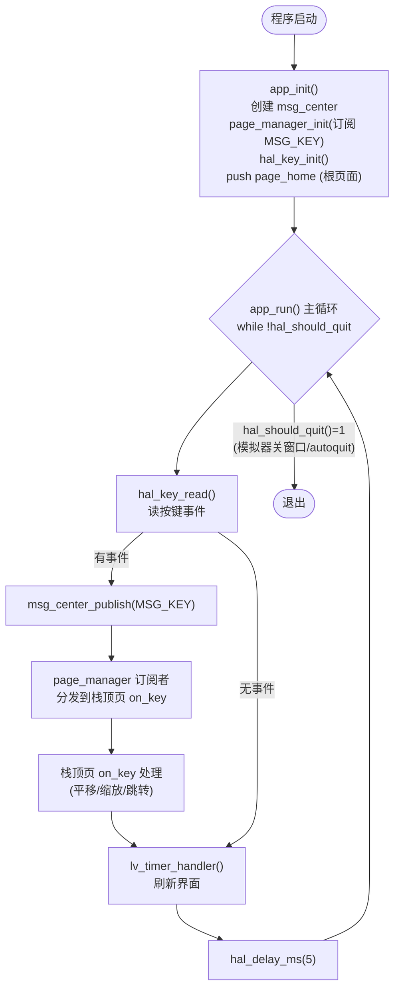
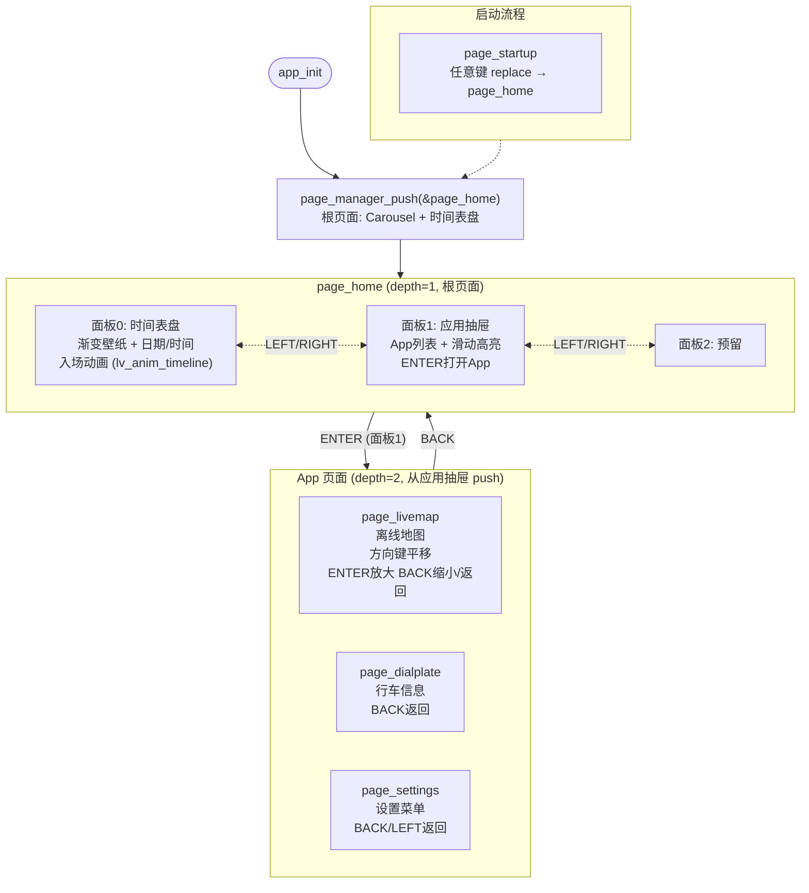
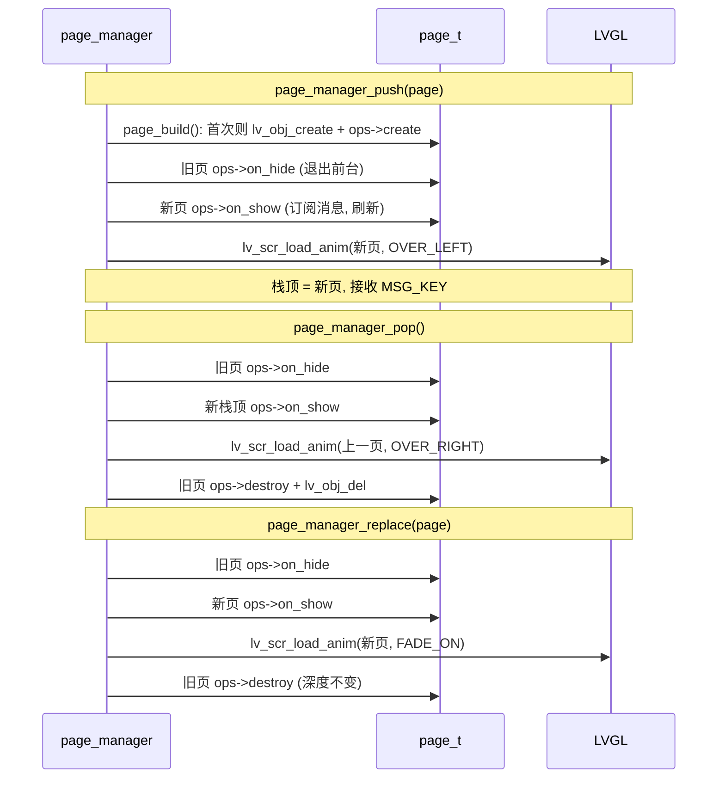
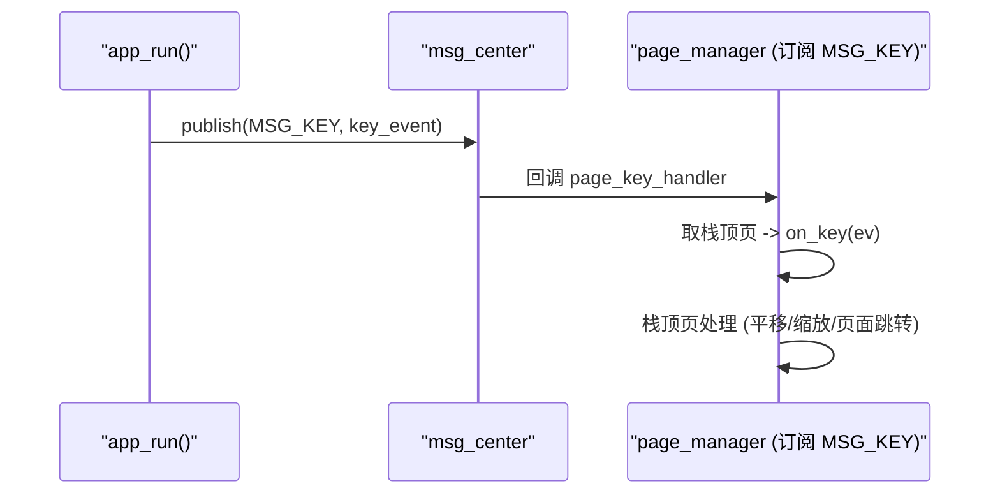

# App 运行流程图 (Flowchart)

## 1. 主循环 app_run()

> 注：当前 HAL 未接入 GPS，主循环只轮询按键，无 GPS 读取/发布。

## 2. 页面导航 (主页 + App 模型)

> `app_init()` 压入 `page_home` 作为**根页面**。主页包含 3 个 Carousel 面板（时间表盘 / 应用抽屉 / 预留），通过 LEFT/RIGHT 滑动切换。从应用抽屉中选择 App 并 push 打开，BACK 键 pop 回主页。

## 3. 页面生命周期 (page_manager)

## 4. 消息发布/订阅时序

> 说明：
> - 按键事件统一经 `MSG_KEY` 总线，由页面管理器在 `page_manager_init` 时订阅，回调中取**栈顶页**调用其 `on_key`；各页只需实现 `on_key`。
> - 页面切换用 LVGL 转场：push 覆盖滑入 (OVER_LEFT)，pop 覆盖滑出 (OVER_RIGHT)，replace 淡入 (FADE_ON)，时长 500ms（`PAGE_ANIM_TIME`）。